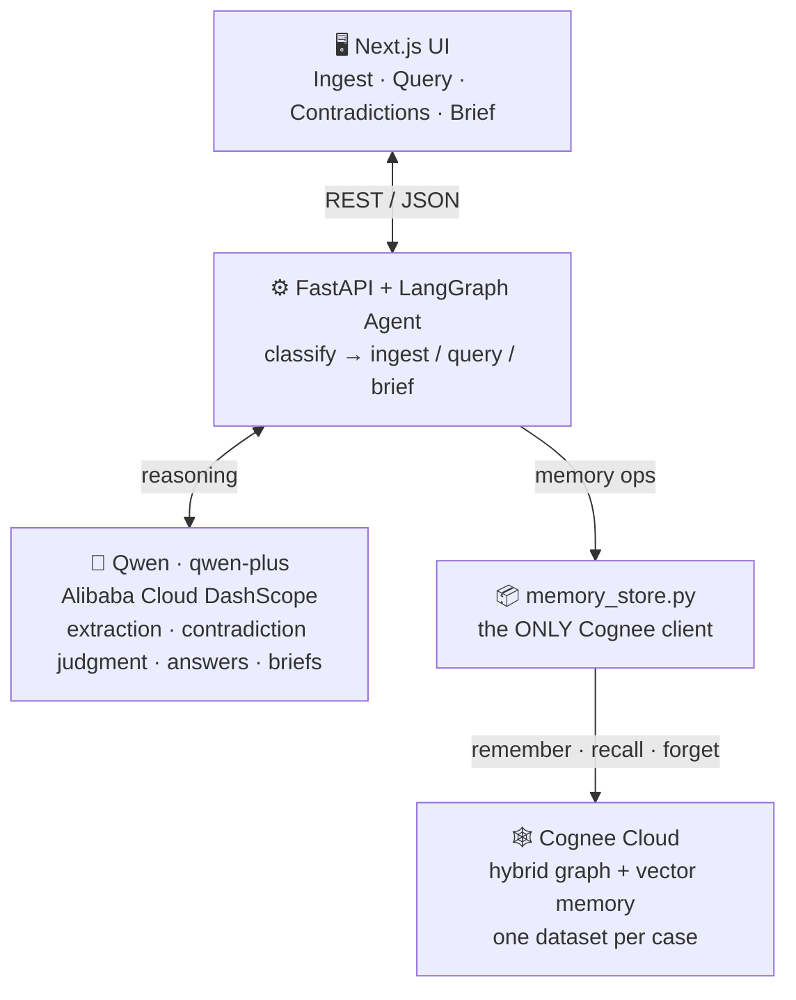
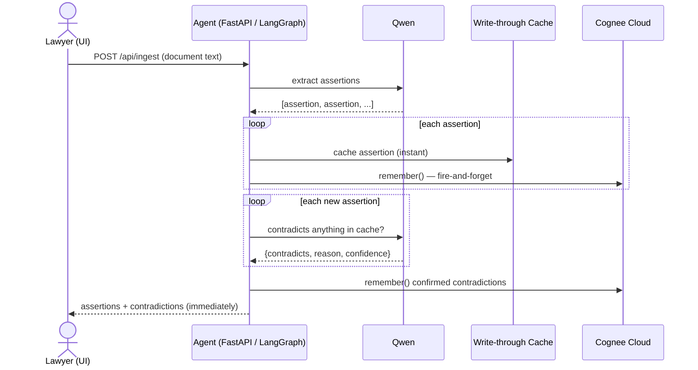
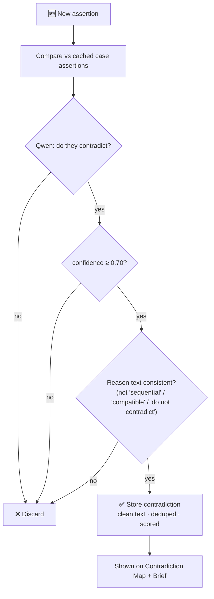
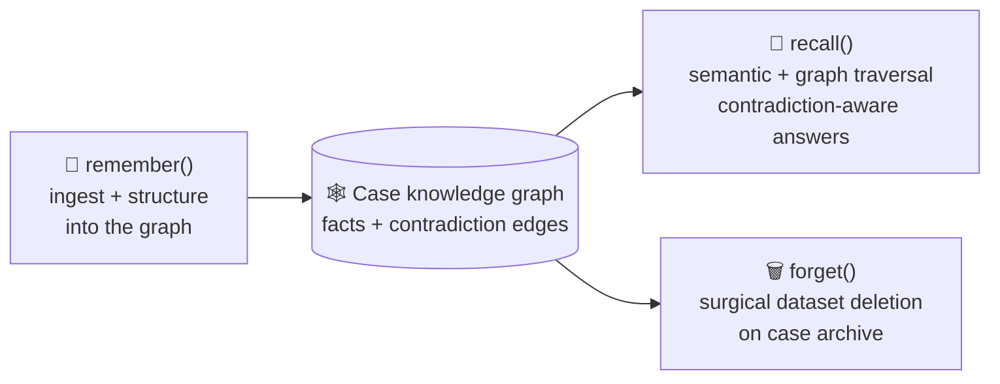

# CourtMind: Building an AI That Never Forgets a Contradiction

*How we built a litigation memory agent on Cognee Cloud + Qwen — and the engineering war stories behind making "the AI that catches witnesses lying" actually work.*

---

## The fact that wins the case is usually a contradiction

Picture a real lawsuit. Thousands of pages of depositions, witness statements, incident reports, contracts. Dozens of people, each telling their version of events over months.

Somewhere in that pile, two statements can't both be true. The inspector swears she never checked the forklift; the supervisor's report says she inspected and cleared it. One witness puts the meeting on Tuesday the 12th; another on Thursday the 14th. **These contradictions are often the whole case.**

Here's the problem: catching them depends on a human remembering, in week six, that someone said the *opposite* in a document they skimmed in week one. Human working memory doesn't scale to thousands of pages. And a chatbot with a context window doesn't either — the moment the conversation rolls over, the earlier testimony is gone.

This is exactly the kind of problem *persistent AI memory* is for. So we built **CourtMind**: an agent that permanently structures every fact a witness states into a knowledge graph, and flags a contradiction the instant a new statement conflicts with anything ever said in the case.

---

## What CourtMind does

- **Ingest** a legal document as plain text. CourtMind extracts the discrete factual assertions — who said what, when, about which event.
- **Detect contradictions** automatically on every ingest, comparing the new assertions against the *entire* case memory — not just the current document. Each contradiction comes with the two conflicting statements, a plain-English reason, and a confidence score.
- **Ask questions** in natural language and get a **sourced, contradiction-aware answer** — even after a full server restart, because the memory lives in the graph, not the session.
- **Generate a trial brief**: executive summary, ranked contradictions with recommended actions, unresolved questions, key assertions.

The demo that makes people lean in: ingest one witness saying the meeting was March 12; ingest a second, days later, saying March 14 — and watch the contradiction appear, scored at 100% confidence, with a reason. Then ask "when was the meeting?" and get an answer that *names both witnesses and flags the conflict on its own.*

---

## Architecture: two brains, one memory boundary

CourtMind separates **memory** from **reasoning**:

- **Cognee Cloud** is the memory — a hybrid graph + vector store holding every fact and contradiction, one dataset per case.
- **Qwen** (`qwen-plus`, via Alibaba Cloud DashScope) is the reasoning — it extracts assertions, judges contradictions, and writes answers and briefs.
- **LangGraph** orchestrates the agent, classifying each request and routing it to ingest, query, or brief.

*(Diagram 1: System architecture — Mermaid + prompt in the appendix.)*

One design rule we held religiously: **only one module imports `cognee`.** Every other file is memory-agnostic and talks to a thin `memory_store` interface. When the memory layer fought us (and it did), we only had one place to fix.

---

## How a document becomes memory

*(Diagram 2: Ingest sequence — in the appendix.)*

1. **Extract** — Qwen turns the raw document into structured assertions (`text`, `speaker`, `event_date`, `entities`).
2. **Remember** — each assertion is `remember()`-ed into the case's Cognee dataset, permanently structuring it into the knowledge graph.
3. **Detect** — each new assertion is compared against the case's existing facts; Qwen judges each pair, and confirmed contradictions are written back into the graph.
4. **Return** — the API responds with the extracted assertions and detected contradictions.

Simple on paper. The interesting part is everything that went wrong.

---

## The hard parts (the real story)

A hackathon README shows the happy path. Here's what actually happened.

### 1. The memory layer started answering like a chatbot

Our first contradiction detector kept coming back empty. When we logged what the memory was returning for a query, we found the culprit: instead of the stored facts, `recall()` was returning things like *"Got it, thanks for the update!"*

Cognee 1.x ships with **conversational session memory on by default**. Our retrieval calls were being routed through that layer and coming back as chat-style acknowledgements rather than the document knowledge graph. The fix was two-fold: disable session memory (`CACHING=false`), and query with **topical noun-phrase queries** ("quarterly review meeting") rather than verbatim sentences — the latter triggered the conversational path, the former returned real chunks. That one took a stack of isolation scripts to pin down.

### 2. The cold-start retrieval problem

Once retrieval returned real data, contradiction detection worked... intermittently. The *same* query would return zero results on the first call and the full set a second later.

Cognee Cloud's search has an **eventual-consistency window** right after ingestion — the graph needs a moment to become queryable. Our detection was landing inside that window and seeing nothing. We added bounded retries, which helped, but it exposed a deeper truth: **the centerpiece feature shouldn't depend on cloud timing at all.**

### 3. The write-through cache

So we stopped fighting it. We keep an in-memory **write-through cache** of every assertion we store, and drive contradiction detection off *that* — instant, deterministic, immune to cloud latency. Cognee remains the persistent system of record for Q&A, cross-session recall, and archival; the cache is just a fast working set in front of it.

This was the single most important architectural decision in the project. It also let us make Cognee persistence **fire-and-forget**: ingestion returns the moment contradictions are detected, and the graph write happens in the background. A slow or degraded cloud can never block or break the feature the whole product is built around.

*(Diagram 3: Contradiction detection flow — in the appendix.)*

### 4. False contradictions, and an AI that argued with itself

With retrieval fixed, precision problems surfaced — the kind a judge notices instantly:

- **Sequential events flagged as contradictions.** "The truck arrived at 2:00 PM" vs "the driver left at 3:15 PM" was flagged as a conflict — the model had inverted the logic (arrival can't precede departure?!). Arrival *before* departure is *expected*. Fix: explicit negative examples and a rule in the prompt distinguishing sequential events from genuine conflicts about the same fact.

- **A verdict that contradicted its own reasoning.** The model returned `contradicts: true` while its own `reason` text said *"…so they do not strictly contradict."* Devastating in a demo. Two fixes: we reordered the prompt so the model writes its reasoning *before* the boolean (commit to the logic first), and we added a code-level guard that rejects any verdict whose reason text hedges ("compatible", "sequential", "do not contradict") regardless of the boolean.

- **Metadata leaking into the UI**, and **near-duplicate contradictions** flooding the screen — both cleaned up with a strip-and-dedupe pass.

The lesson: an LLM judge is only as trustworthy as the guards around it. The prompt gets you 90%; deterministic post-checks get you the last 10% that matters on stage.

---

## Best use of Cognee: the memory lifecycle

CourtMind leans on Cognee's flagship lifecycle API, all behind that one `memory_store` boundary:

- **`remember()`** — ingest + permanently structure each assertion and contradiction into the graph. The system of record.
- **`recall()`** — the Q&A path. It auto-routes between semantic similarity and graph traversal, and returns a graph-grounded answer that is *already contradiction-aware* — in testing, asking about a disputed date returned an answer that surfaced both conflicting dates on its own.
- **`forget()`** — archiving a case surgically deletes its entire dataset.

*(Diagram 4: Cognee memory lifecycle — in the appendix.)*

Each case maps 1:1 to a Cognee dataset (`dataset_name = case_id`), giving clean per-case isolation over the shared graph-vector store.

We'll also be honest about what we *didn't* get working: Cognee's enrichment ops (`improve`/`memify`) aren't enabled on our tenant, and we chose to disclose that rather than fake it. The core value — persistent structured memory and cross-session contradiction detection — is fully delivered by `remember` / `recall` / `forget`.

---

## What we learned

- **Persistent memory changes what an agent *is*.** CourtMind's value grows with everything it has ever ingested. That's a fundamentally different product than a stateless assistant, and it's only possible with a real memory layer.
- **Put the reliability where the value is.** The write-through cache in front of Cognee wasn't in the original design — it emerged from a failure, and it's what makes the demo bulletproof.
- **LLM judges need deterministic guardrails.** Prompt engineering plus code-level consistency checks beat either alone.
- **Isolate your dependencies.** One file importing `cognee` turned every cloud surprise into a one-place fix.

---

## Try it

CourtMind is open source (MIT). It runs on Cognee Cloud + Alibaba Cloud DashScope (Qwen), with a FastAPI/LangGraph backend and a Next.js frontend. Point it at a case, paste in the documents, and watch it catch the contradictions no one would have found in time.

*The most valuable fact in the case is the one that can't be true. CourtMind is the memory that remembers it.*

---
---

# Appendix — Diagram assets

Paste the Mermaid blocks directly into Medium/Dev.to/GitHub/Notion (they render Mermaid). Or feed the "AI image prompt" versions into an image generator for stylized visuals.

## Diagram 1 — System architecture

**Mermaid:**


**AI image prompt (for a stylized hero/architecture visual):**
> A clean, modern software architecture diagram for a legal-tech app called "CourtMind." Three horizontal layers connected by arrows: (1) a web UI browser window labeled "Next.js UI" with four tabs: Ingest, Query, Contradictions, Brief; (2) a central "FastAPI + LangGraph Agent" box that branches to two boxes — a brain icon labeled "Qwen (reasoning)" and a knowledge-graph/network icon labeled "Cognee Cloud (memory: graph + vector)"; the Cognee box shows small connected nodes forming a graph. Professional navy-and-slate color palette, thin lines, lots of whitespace, flat vector style, subtle legal motif (a small scales-of-justice icon). Landscape orientation, high resolution.

## Diagram 2 — Ingest sequence (document → memory + contradictions)

**Mermaid:**


## Diagram 3 — Contradiction detection decision flow

**Mermaid:**


**AI image prompt (stylized decision-flow visual):**
> A clean vertical flowchart illustration titled "How CourtMind decides a contradiction." Boxes connected top to bottom: "New statement" → "Compare against all remembered facts" → diamond "Do they conflict?" → diamond "Confidence ≥ 70%?" → diamond "Does the reasoning agree?" → green box "Flagged contradiction." Rejected branches point to a faded 'discard' box. Modern flat vector style, navy/slate/green palette, rounded rectangles, thin connectors, professional legal-tech aesthetic, plenty of whitespace.

## Diagram 4 — The Cognee memory lifecycle

**Mermaid:**


**AI image prompt (conceptual lifecycle visual):**
> A circular lifecycle diagram showing three stages around a central glowing knowledge-graph of connected nodes: "REMEMBER — ingest & structure facts", "RECALL — reason across the graph", "FORGET — retire the case". Each stage is an icon with a short label, arrows flowing between them and the central graph. Deep navy background, teal and gold accents, elegant flat-vector infographic style, legal-tech feel, high resolution, square orientation.

## Optional — Blog hero image

**AI image prompt:**
> Editorial hero illustration for an article about AI and law. A translucent glowing neural knowledge-graph of interconnected nodes overlaid on a stack of legal documents and a courtroom setting, with two speech bubbles containing conflicting dates highlighted and linked by a red "contradiction" line. Sophisticated, cinematic, navy-and-gold color scheme, subtle scales-of-justice motif, flat-modern vector-meets-editorial style, wide landscape banner, lots of negative space for a title overlay.
```
